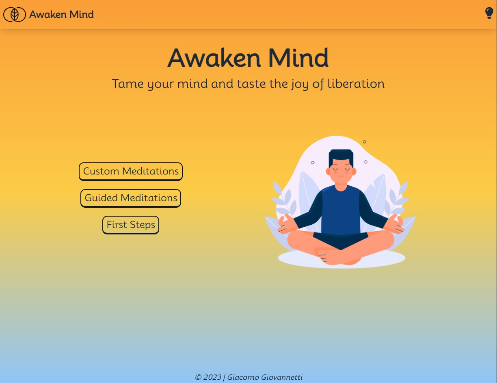
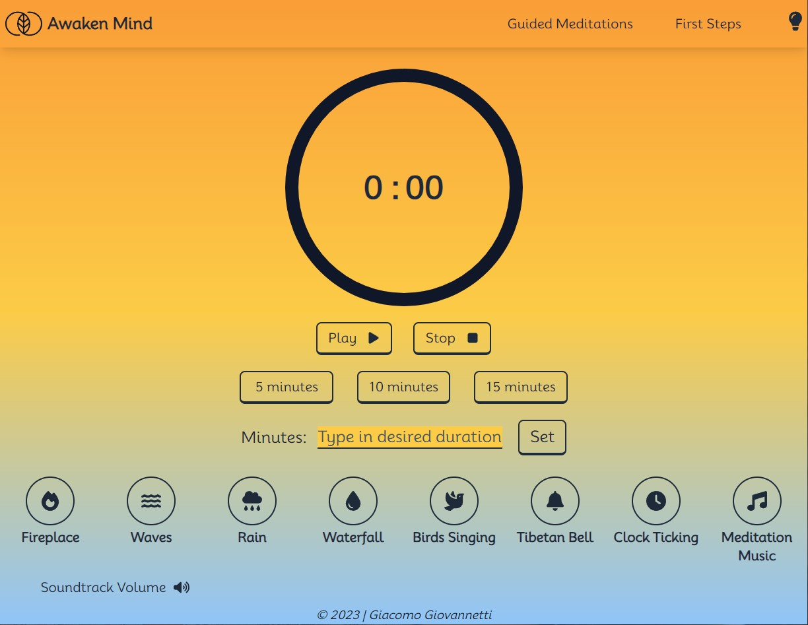
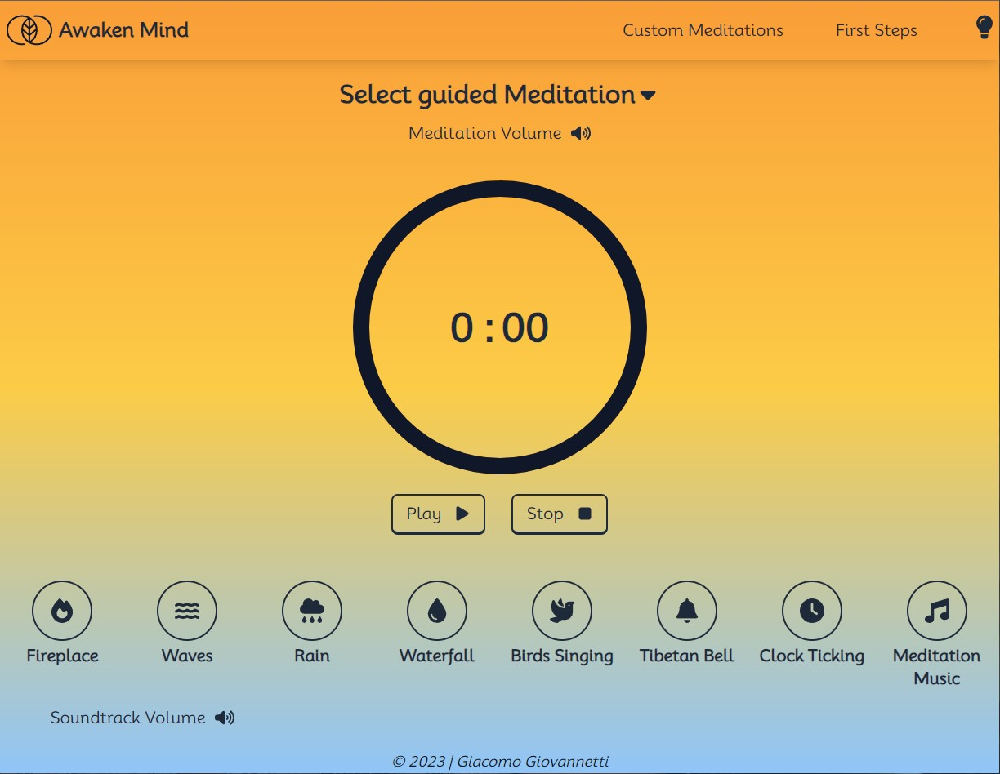
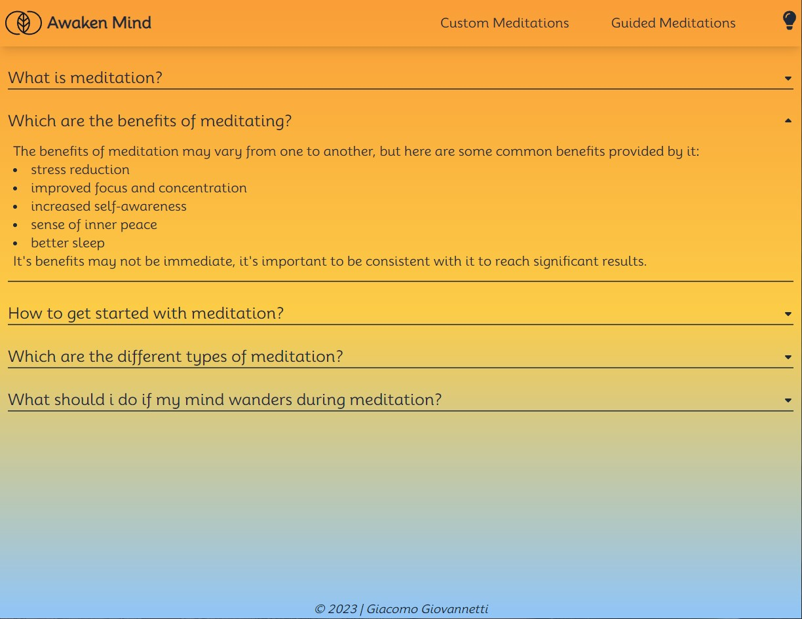
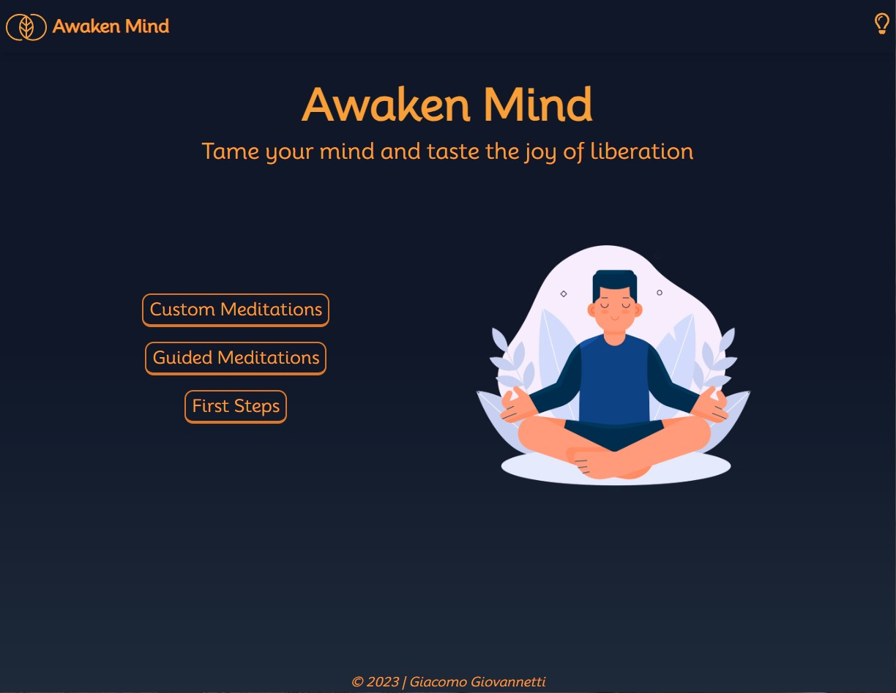
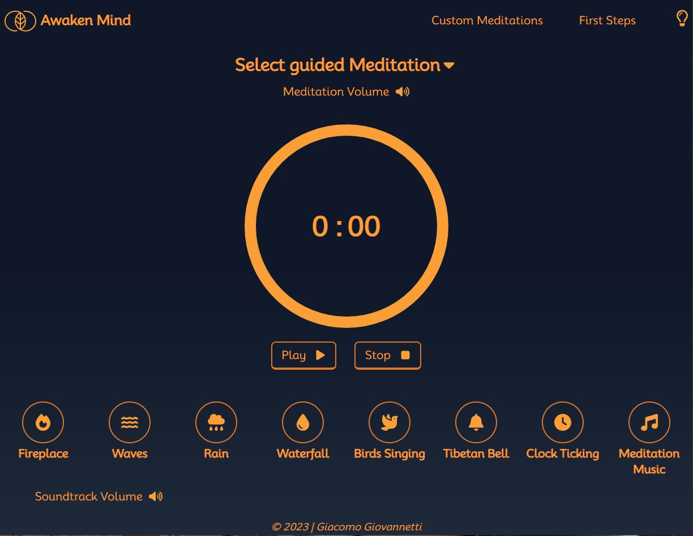
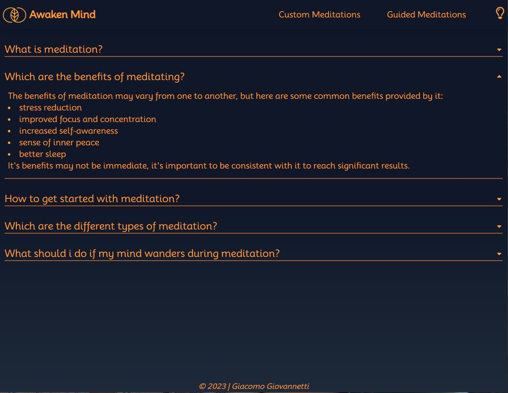

# Awaken Mind

## React Project by Giacomo Giovannetti

### A Meditation app to practice meditations in a fast and simple way by setting a timer for a custom duration or by following a guided meditation

## :bookmark_tabs: Index

- [About the project](#floppy_disk-about-the-project)
- [How it works](#mag-how-it-works)
- [Languages](#keyboard-languages)
- [Framework](#hammer_and_pick-framework)
- [Libraries](#books-libraries)
- [Bundler](#package-bundler)
- [Try it](#computer-try-it)
- [Issues](#warning-issues)
- [Contact Me](#email-contact-me)

## :floppy_disk: About the project

This is a project realized for [Start2Impact's](https://www.start2impact.it/) -React- module of the Full Stack Web Developer course. For this project i had to build a Web app to practice meditation, the app had to include some features such as :

- A timer programmable by the user
- The timer could be stopped or resumed
- References about meditation
- Intuitive UX/UI

The project had also to include some specific technologies like:

- React Router
- React Hooks
- Context API / Redux

### My Idea:

My Idea for this project was to build it around 4 pages:

- Homepage: Where the user lands as he opens the app, it had to include the navigation buttons to the other pages.
- Custom Meditation: A place where the user could practice meditation on his terms, by setting up a custom timer and choosing his soundtrack.
- Guided Meditation: Here the user can practice meditation by following some guided meditations while choosing the soundtrack he wants to have in the background
- First Steps: The scope for this page is to guide users new to meditation through its basic concepts.

To navigate through those pages i thought about a navBar that would change his links based on the page the user is on.

## :mag: How it works

As you land in the app there are a few elements visible:

- A simple header made by the app logo, the app name and a button to toggle the dark mode
- A Title with the app name and a subtile with the slogan
- The navigation buttons to go to the other pages of the app
- An image referencing meditation
- A simple footer

  

The meditation pages are very similar with each other, since they are based on the same components :

- Timer component : where all the states regarding the timer are held, with his jsx and styling. It also includes the buttons to start/stop/pause the timer and their related logic.
- Soundtrack component : here are held the states related to the soundtracks as their jsx and styling. Inside of it we can find the audio manager component which handles the playing soundtrack and its volume.

Differences between Custom and Guided Meditation pages :

- Custom Meditations include the duration buttons component which is responsible to provide the timer a given duration based on fixed values by click the relative buttons or on a custom value by specifying it in the input and then submitting it.

- Guided Meditations has the menu guided meditations component which displays a drop down menu containing the guided meditations and their related logic, the user can chose one simply by clicking it. The timer duration will be automatically set to the duration of the guided meditation. In this component we can also find the audio manager component in order to manage the playing guided meditation and its volume, which is separated from the soundtrack volume.

To be noted: in order for the app to work the user has to select a duration for the timer if he is on the custom meditation page, or select a guided meditation if he is on the guided meditation page. Otherwise there will be an alert and the timer would not start.
 

The First Steps page is made by a series of drop down text cards containing the answer to the relative question. The answer is shown as soon as the user clicks on one of the questions and will automatically close when he clicks on another question.

The App gives the possibility to toggle dark mode, in order to set the app color to a darker shade.
  

## :keyboard: Languages

- HTML5
- Javascript

## :hammer_and_pick: Frameworks

- [React](https://react.dev/)
- [Tailwind CSS](https://tailwindcss.com/)

## :books: Libraries

- [Nanoid](https://www.npmjs.com/package/nanoid)

## :package: Bundler

- [Vite](https://vitejs.dev/)

## :computer: Try it!

That's my project, try it here: [Awaken Mind](https://awaken-mind.netlify.app/)

## :warning: Issues

At the moment the project should run without problems. In case you find some issues let me know!

## :email: Contact Me

My Linkedin Profile: [Linkedin](https://www.linkedin.com/in/giacomogiovannetti/)

My email if you have any questions: giovannettii.giacomo@gmail.com
